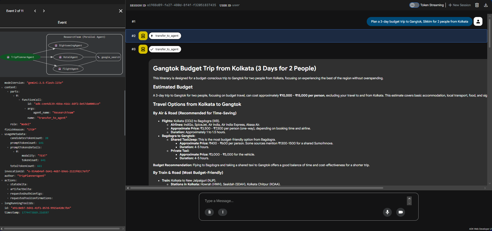
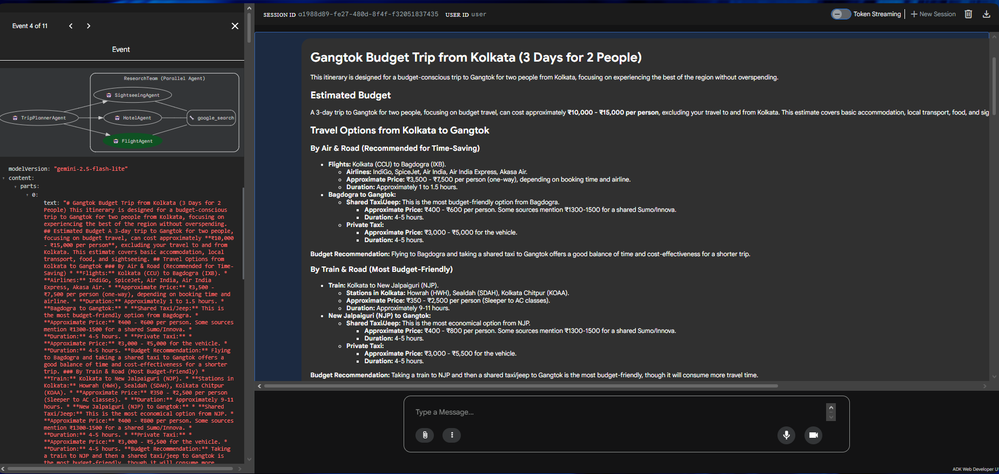
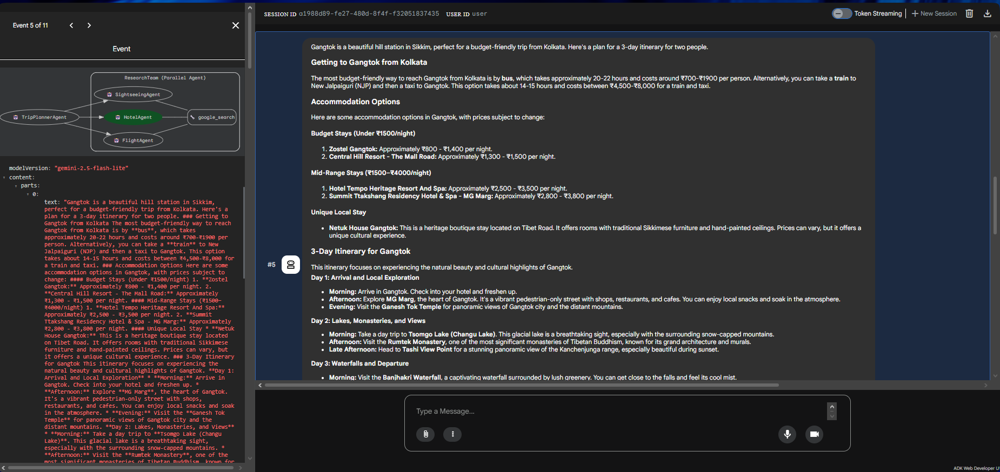
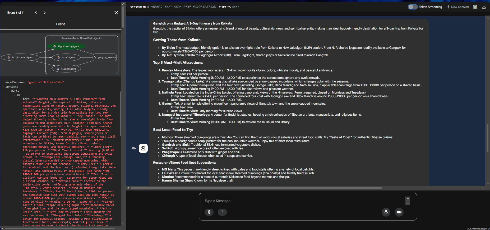

---

##  What Is This?

**Multi-Agent Travel Planner** is an intelligent, multi-agent travel planning system built using **Google's Agent Development Kit (ADK)**. It leverages a coordinated network of AI agents — each a domain specialist — that work in parallel to research and generate a complete, structured travel plan from a single user query.

This project demonstrates real-world application of **multi-agent collaboration**, **agent-to-agent (A2A) communication**, **live web search grounding**, and **orchestrated task delegation** — all running locally with zero cloud infrastructure.

---

##  What Does It Do?

Given a natural language query like:

> *"Plan a 3-day budget trip to Gangtok, Sikkim for 2 people from Kolkata"*

The system autonomously:

- Researches **transport options** (flights, trains, buses) with real prices
- Finds **accommodation** across budget and mid-range categories
- Identifies **top attractions**, local food, and cultural experiences
- Assembles everything into a **structured day-by-day itinerary**
- Estimates a **total trip budget in INR**
- Flags **permits, visas, and seasonal advisories**

All of this happens through a network of specialised agents working simultaneously — not sequentially.

---

##  Purpose & Capabilities

This agent is **fully generalised** — it handles any destination worldwide, not just Indian routes. You can ask it about:

- Domestic Indian destinations (Goa, Manali, Puri, Darjeeling, etc.)
- Northeast India (Sikkim, Meghalaya, Arunachal — with permit advisories)
- International destinations (Bali, Tokyo, Dubai, Paris, etc.)
- Different traveller profiles: solo, couple, family, business

**Key capabilities:**

-  Live web search grounding via `google_search` tool — no stale training data
-  Parallel agent execution — 3 specialists research simultaneously, cutting response time
-  Session memory — remembers conversation context across multi-turn queries
-  Structured output — consistent, readable plan format every time
-  Worldwide coverage — any destination, any budget level

---

##  Architecture — How the Agents Communicate

This project implements a **hierarchical multi-agent system** using Google ADK's `Agent` and `ParallelAgent` primitives.

```
User Query
    │
    ▼
TripPlannerAgent          ← Root Orchestrator (talks to user)
    │
    │  delegates via A2A transfer
    ▼
ResearchTeam              ← ParallelAgent (fires all 3 simultaneously)
    ├── FlightAgent        ← Transport specialist
    ├── HotelAgent         ← Accommodation specialist
    └── SightseeingAgent   ← Attractions & culture specialist
```

**How A2A communication works here:**

1. The user speaks only to `TripPlannerAgent` (the root agent)
2. The root agent analyses the query, extracts destination, duration, budget, and traveller details
3. It issues a `transfer_to_agent` call — this is the **A2A protocol** in action — delegating the research task to `ResearchTeam`
4. `ResearchTeam` is a `ParallelAgent` that **fires all three specialist agents simultaneously**, each independently calling `google_search` for live data
5. All three results return to the root agent, which synthesises them into the final structured plan

The root agent acts as an **orchestrator** — it never searches itself. It instructs, delegates, waits, and assembles. This separation of concerns is what makes the architecture clean and scalable.

---

##  Why Gemini 2.5 Flash-Lite?

After evaluating all available models on the free tier, `gemini-2.5-flash-lite` was the deliberate choice for this project for three reasons:

- **Highest free-tier throughput** — 15 RPM and 1,000 RPD, the best available without billing
- **Sufficient reasoning quality** — handles structured instruction-following, tool use, and multi-step delegation reliably
- **Speed** — Flash-Lite's lower latency means parallel agents return faster, reducing total response time for the full pipeline

For a portfolio project where demonstrating agent architecture matters more than raw model power, Flash-Lite hits the ideal balance of capability, speed, and cost.

---

##  ADK Web UI — Agent in Action

The following screenshots show the system running inside Google ADK's visual development interface (`adk web`). The left panel shows the full agent invocation trace; the right panel shows the assembled output.

---

### 1. Root Agent — Transfer to Research Team


*The `TripPlannerAgent` receives the user query and issues a `transfer_to_agent` call, delegating research to the `ResearchTeam` parallel agent. This is the A2A handoff in action.*

---

### 2. FlightAgent — Transport Research


*`FlightAgent` independently calls `google_search` to find current flight, train, and bus options with live prices. Output is returned to the root agent for assembly.*

---

### 3. HotelAgent — Accommodation Research


*`HotelAgent` searches for budget and mid-range accommodation options at the destination, including homestays and unique local stays.*

---

### 4. SightseeingAgent — Attractions & Experiences


*`SightseeingAgent` researches top attractions, local food spots, entry fees, and culturally unique experiences at the destination.*

---

##  Running Locally — Complete Setup Guide

### Prerequisites

- Python 3.11+ (3.10 works but triggers a deprecation warning)
- A Google AI Studio API key (free, no billing required)
- VS Code or any terminal

---

### Step 1 — Clone the Repository

```bash
git clone https://github.com/Barun-Work04/TRAVEL_AGENT_ADK.git
cd TRAVEL_AGENT_ADK
```

---

### Step 2 — Create & Activate Virtual Environment

```bash
python -m venv .venv

# Windows
.venv\Scripts\activate

# macOS / Linux
source .venv/bin/activate
```

---

### Step 3 — Install Dependencies

```bash
pip install -r requirements.txt
```

---

### Step 4 — Get Your API Key

1. Go to [aistudio.google.com](https://aistudio.google.com)
2. Click **Get API Key** → **Create API Key**
3. Select or create a project
4. Copy the key

> **Free tier limits:** 15 RPM / 1,000 RPD for `gemini-2.5-flash-lite`. No billing needed.

---

### Step 5 — Configure Environment

Create a `.env` file in the project root:

```
GOOGLE_API_KEY=your_api_key_here
GOOGLE_GENAI_USE_VERTEXAI=FALSE
```

> ⚠️ Never commit `.env` to GitHub. It is already listed in `.gitignore`.

---

### Step 6 — Run the Files (In Order)

**Basic agent — no tools, no memory:**
```bash
python 01-simple-agent.py
```

**Agent with conversation memory:**
```bash
python 02-simple-agent-memory.py
```

**Agent with live Google Search:**
```bash
python 03-agent-tools.py
```

**Full multi-agent system (terminal output):**
```bash
python 04-multi-agent.py
```

**Visual ADK Web UI:**
```bash
adk web
```
Then open `http://localhost:8000` in your browser, select `travel_planner` from the dropdown, and type your query.

---

### Changing the Destination

In `04-multi-agent.py`, edit the last line:

```python
asyncio.run(plan_trip("Plan a 5-day trip to Bali for 2 people, mid-range budget"))
```

The agent handles any destination worldwide.

---

##  Alternate Configuration

This project uses Google AI Studio as the backend by default (`GOOGLE_GENAI_USE_VERTEXAI=FALSE`). As an alternative, you can route requests through **Google Vertex AI** — useful if you have GCP credits or need enterprise-grade quota. To switch, set `GOOGLE_GENAI_USE_VERTEXAI=TRUE` in your `.env` and configure your `gcloud` credentials accordingly. Vertex AI also unlocks access to a broader range of Gemini model variants.

---

##  Project Structure

```
travel-agent-adk-a2a/
├── .env                          # API key (not committed)
├── .gitignore
├── requirements.txt
├── 01-simple-agent.py            # Single agent, no tools
├── 02-simple-agent-memory.py     # Session memory demo
├── 03-agent-tools.py             # Agent + Google Search
├── 04-multi-agent.py             # Full parallel multi-agent system
└── travel_planner/               # ADK web UI package
    ├── __init__.py
    └── agent.py                  # root_agent defined here
```

---

##  Tech Stack

| Layer | Technology |
|---|---|
| Agent Framework | Google Agent Development Kit (ADK) |
| LLM | Gemini 2.5 Flash-Lite |
| Communication Protocol | Google A2A (Agent-to-Agent) |
| Live Search | Google Search Tool (built into ADK) |
| Session Management | ADK InMemorySessionService |
| Environment | Python 3.11, python-dotenv |
| UI | ADK Web Dev Interface |

---

